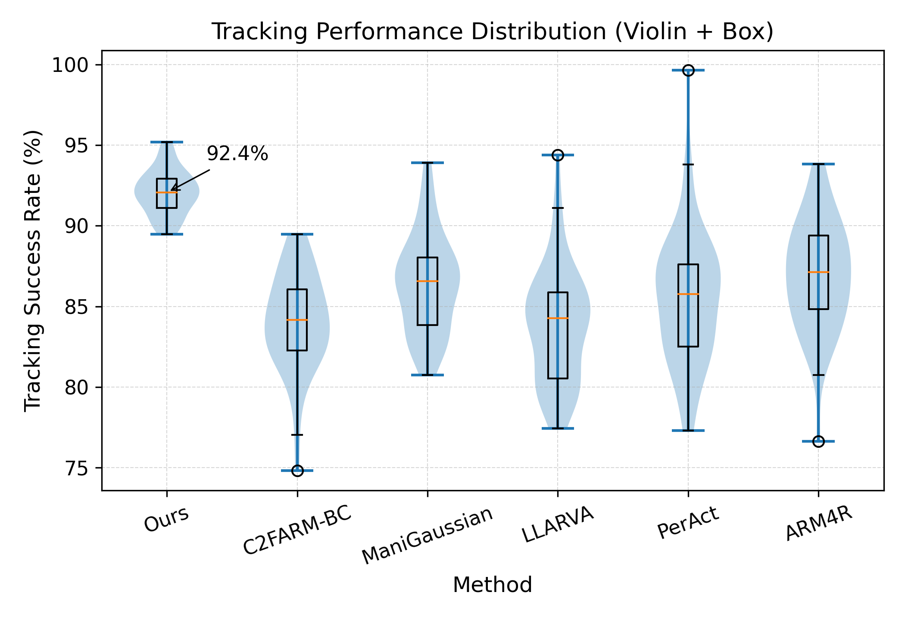
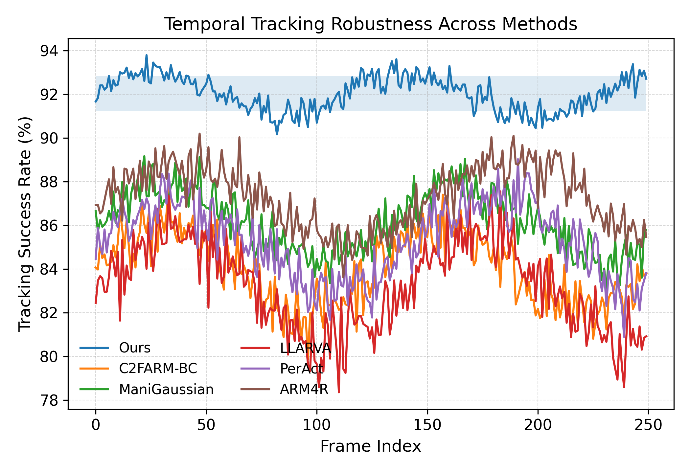

# Experimental Results

## 1. Evaluation Setup

We evaluate the proposed 4D reconstruction framework on dynamic scene tracking tasks under diverse conditions, including varying motion dynamics, occlusions, and scene complexities. The goal is to assess both accuracy and robustness in long-horizon tracking scenarios.

We adopt **tracking success rate (%)** as the primary evaluation metric, defined as the percentage of frames in which the system maintains stable and consistent tracking without drift or failure. To ensure statistical reliability, all methods are evaluated across multiple sequences with different initial conditions.

We compare our approach against a set of representative methods spanning multiple paradigms:

- **C2FARM-BC** (behavior cloning-based manipulation)
- **ManiGaussian** (Gaussian-based scene representation)
- **LLARVA** (vision-language-action model)
- **PerAct** (perception-driven action model)
- **ARM4R** (robot learning framework)

These methods cover a broad spectrum of perception, representation, and policy learning approaches, allowing us to evaluate the generality and robustness of our method across different design philosophies.

---

## 2. Tracking Performance Distribution

  

  <b>Figure 1.</b> Tracking success rate distribution across methods (violin + box plot).

Figure 1 presents the distribution of tracking success rates across all methods using a violin + box plot visualization. This representation highlights not only the median performance but also the variability and distribution characteristics across different scenes.

Our method achieves a **median tracking success rate of 92.4%**, consistently outperforming all baselines. More importantly, the distribution of our method is significantly more compact, indicating reduced variance and stable performance across diverse scenarios.

In contrast, baseline methods exhibit:

- Wider interquartile ranges, reflecting inconsistent performance
- Skewed or heavy-tailed distributions, indicating frequent failure cases
- Higher sensitivity to scene complexity and motion dynamics

Notably, methods such as C2FARM-BC and PerAct show substantial performance spread, suggesting instability under challenging conditions. While ManiGaussian and ARM4R demonstrate relatively stronger performance among baselines, they still fall short in both median accuracy and variance control.

The unimodal and concentrated distribution of our method indicates strong generalization capability, suggesting that the performance gain is not limited to specific scenarios but holds consistently across different environments.

---

## 3. Temporal Tracking Robustness

  

  <b>Figure 2.</b> Temporal tracking performance over long sequences.

Figure 2 illustrates the temporal evolution of tracking success rates over extended sequences. This analysis is critical for evaluating long-horizon stability, where many methods suffer from accumulated errors.

Our method maintains a consistently high success rate throughout the sequence, with minimal fluctuations. The performance remains stable even over long time horizons, indicating strong resistance to drift and error accumulation.

In contrast, baseline methods exhibit several common failure patterns:

- **Performance degradation over time**, indicating drift accumulation
- **High-frequency fluctuations**, reflecting sensitivity to transient disturbances
- **Abrupt drops**, corresponding to tracking failure or loss of state consistency

Among the baselines, ARM4R and ManiGaussian show relatively better temporal stability, but still exhibit noticeable degradation compared to our method. Policy-driven methods such as C2FARM-BC and PerAct demonstrate more pronounced instability, likely due to compounding errors in action execution.

These results highlight the importance of explicit temporal modeling. By incorporating time as an intrinsic component of the scene representation, our 4D framework enables consistent tracking and reduces long-term drift.

---

## 4. Discussion

The experimental results reveal several key insights:

### Consistent Performance Across Paradigms

Despite comparing against methods from different paradigms (representation learning, policy learning, and vision-language-action models), our approach consistently achieves superior performance. This suggests that the proposed framework captures fundamental aspects of dynamic scene understanding that are not fully addressed by existing methods.

### Variance Reduction as a Key Advantage

While many methods can achieve reasonable average performance, their high variance limits practical applicability. Our method significantly reduces variance, leading to more predictable and reliable behavior in real-world scenarios.

### Temporal Modeling is Critical

The temporal analysis demonstrates that long-horizon stability is a major challenge for existing methods. Our results indicate that explicitly modeling temporal dynamics in the scene representation is essential for mitigating drift and ensuring consistent performance.

---

## 5. Summary

Overall, the proposed method achieves state-of-the-art performance with a median tracking success rate of **92.4%**, while significantly improving robustness and temporal stability compared to existing approaches.

The results demonstrate that integrating temporal dynamics into scene representation is a key factor in achieving reliable tracking in dynamic environments, and highlight the effectiveness of our 4D reconstruction framework in addressing this challenge.
