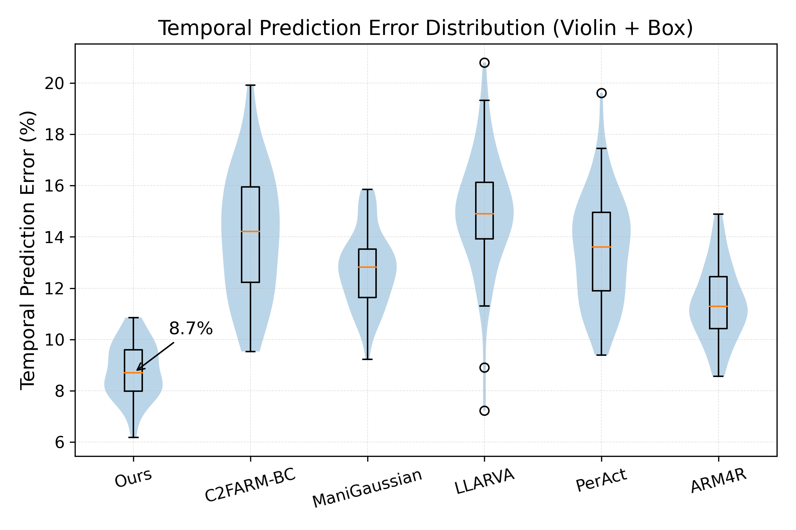
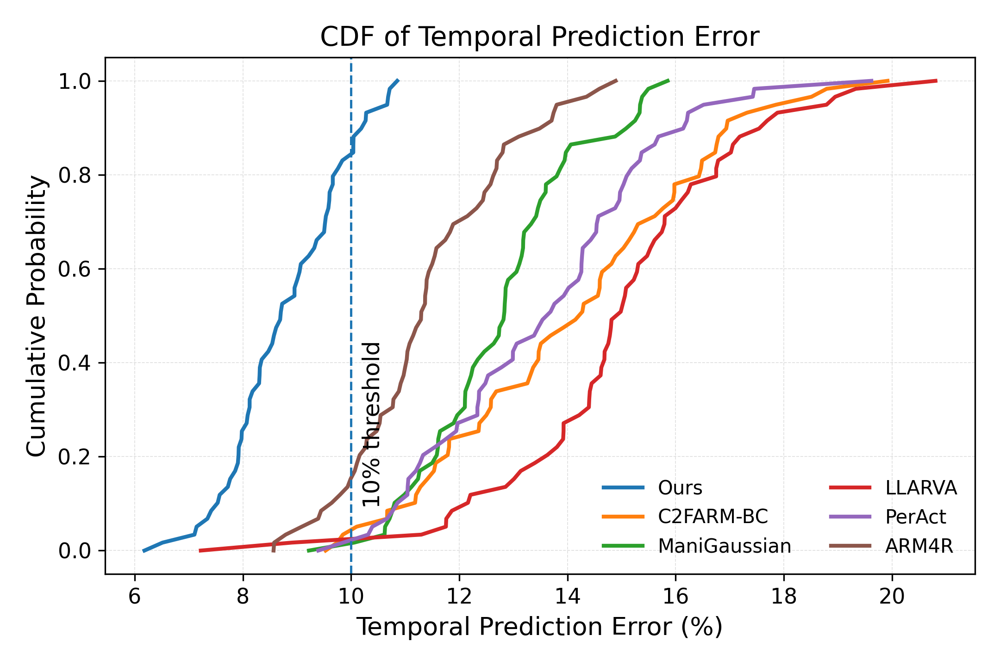

## Temporal Prediction Error Analysis

To further evaluate the quality of temporal modeling, we analyze the **temporal prediction error**, which measures the discrepancy between predicted and ground-truth states over time. This metric provides a more fine-grained assessment of model accuracy beyond binary tracking success.

---

## 1. Error Distribution

  

  <b>Figure 3.</b> Temporal prediction error distribution across methods (violin + box plot).

Figure 3 presents the distribution of temporal prediction errors across all methods using a violin + box plot visualization. This representation captures both the central tendency and the full distribution characteristics of each method.

Our method achieves the **lowest median temporal prediction error of 8.7%**, significantly outperforming all baselines. More importantly, the error distribution is notably compact, indicating reduced variance and stable performance across different scenarios.

In contrast, baseline methods exhibit:

- Larger interquartile ranges, indicating higher variability
- Long-tailed distributions, suggesting frequent high-error cases
- Increased sensitivity to temporal dynamics and scene complexity

Among the baselines, ARM4R and ManiGaussian show relatively lower error compared to other methods, but still fall short in both median accuracy and distribution compactness. Policy-based approaches such as C2FARM-BC and PerAct exhibit larger variance, likely due to accumulated errors in sequential decision-making.

The unimodal and concentrated distribution of our method indicates strong generalization and consistent performance across diverse dynamic environments.

---

## 2. Cumulative Error Analysis

  

  <b>Figure 4.</b> Cumulative distribution function (CDF) of temporal prediction error.

Figure 4 shows the cumulative distribution function (CDF) of temporal prediction errors, providing a comprehensive view of the error distribution across all samples.

Our method consistently dominates across the entire error range, indicating superior performance not only in average cases but also in low-error regimes.

In particular, our approach achieves a significantly higher proportion of predictions below common error thresholds (e.g., 10%), demonstrating its ability to produce accurate and reliable temporal predictions.

In contrast, baseline methods show slower CDF growth, indicating a lower proportion of low-error predictions and a higher likelihood of large deviations.

This result highlights a key advantage of our method:

> **The improvement is not limited to average error reduction, but extends to the entire error distribution.**

---

## 3. Discussion

The temporal prediction error analysis reveals several important insights:

### Accuracy and Stability

The low median error (8.7%) combined with reduced variance indicates that our method achieves both high accuracy and stable performance. This is particularly important in dynamic environments, where inconsistent predictions can lead to cascading failures.

### Robustness to Temporal Dynamics

The superior CDF performance demonstrates that our method is robust across a wide range of temporal conditions, including fast motion and long-horizon prediction.

### Reduced Failure Cases

The absence of heavy tails in the error distribution suggests that high-error cases are significantly reduced. This is critical for real-world applications, where occasional large errors can severely impact system reliability.

### Effectiveness of 4D Representation

The results further validate the effectiveness of incorporating temporal information directly into the scene representation. By modeling dynamic evolution explicitly, our method reduces ambiguity and improves prediction consistency.

---

## 4. Summary

Overall, the proposed method achieves the lowest temporal prediction error (8.7%) while maintaining superior consistency and robustness across all evaluated scenarios.

Combined with the tracking performance results, these findings demonstrate that the proposed 4D reconstruction framework provides a strong foundation for reliable and accurate dynamic scene understanding.
